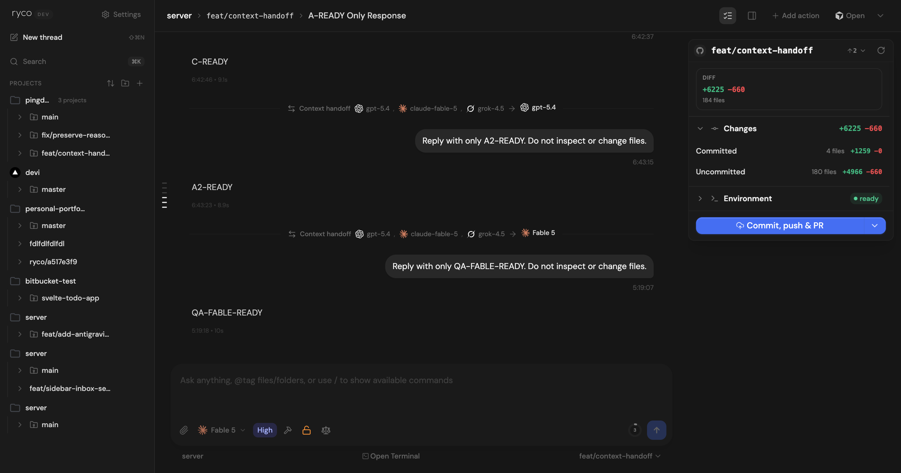
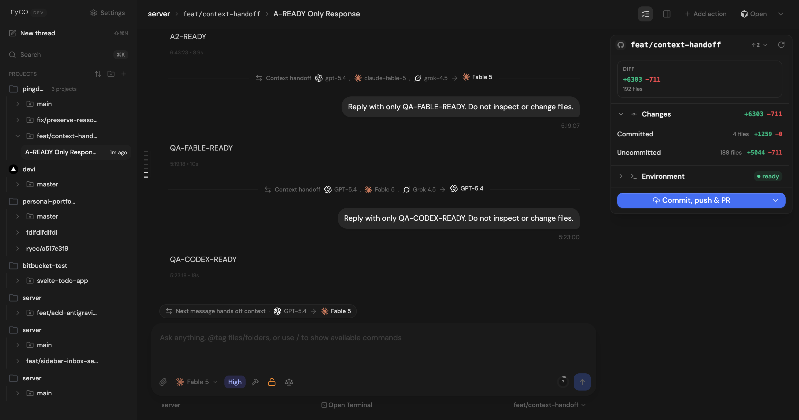
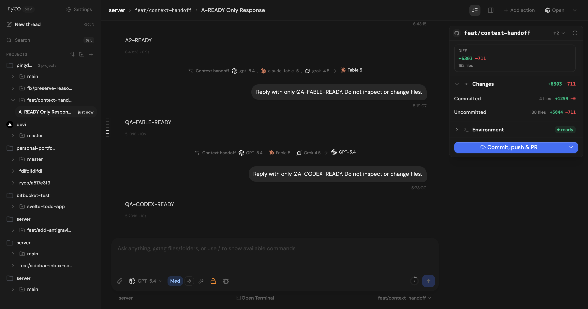

# Dogfood Report: Ryco Context Handoff Presentation

| Field       | Value                                              |
| ----------- | -------------------------------------------------- |
| **Date**    | 2026-08-05                                         |
| **App URL** | http://localhost:5735                              |
| **Session** | context-handoff-qa-eb44b9ae6a8d                    |
| **Scope**   | Pending handoff chip and completed handoff divider |

## Summary

| Severity  | Count |
| --------- | ----- |
| Critical  | 0     |
| High      | 0     |
| Medium    | 1     |
| Low       | 0     |
| **Total** | **1** |

The single issue found during the focused pass was fixed and reverified in the same session.

## Issues

### ISSUE-001: Prior lineage entries retained raw model slugs

| Field           | Value                        |
| --------------- | ---------------------------- |
| **Severity**    | medium                       |
| **Category**    | content                      |
| **URL**         | http://localhost:5735        |
| **Status**      | fixed and verified           |
| **Repro Video** | N/A — static divider content |

**Description**

After a new handoff, the immediate target used the friendly picker label (`Fable 5`), but source
endpoints carried forward from older handoffs still showed stored slugs such as
`claude-fable-5`. Every endpoint in a newly projected divider now refreshes its provider and model
presentation from the current provider catalog before persistence.

**Evidence**

1. Before the fix, a newly completed multi-hop divider mixed legacy slugs with the friendly target.
   

2. After the fix, the pending chip still presented the staged handoff above the composer.
   

3. The next completed divider used friendly labels for the full lineage and target, and the chip was
   removed after dispatch.
   
